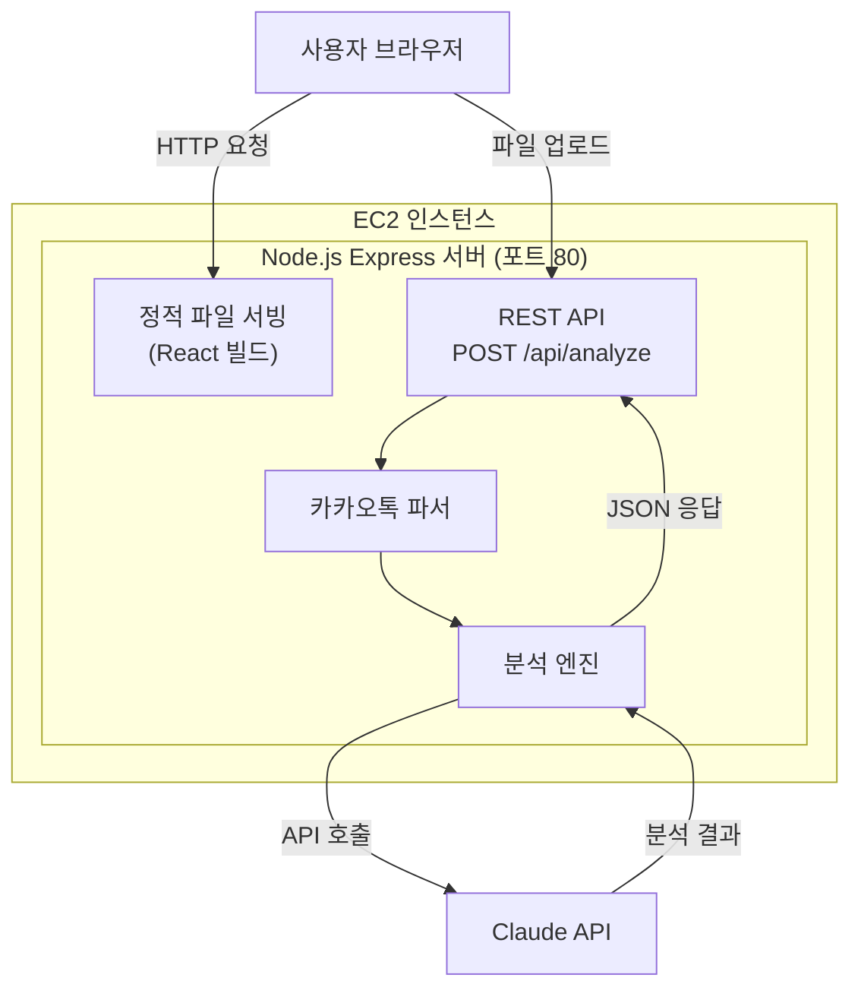
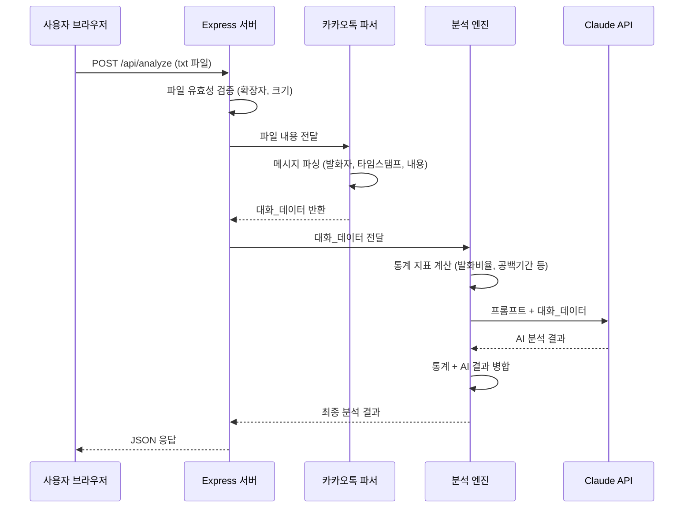
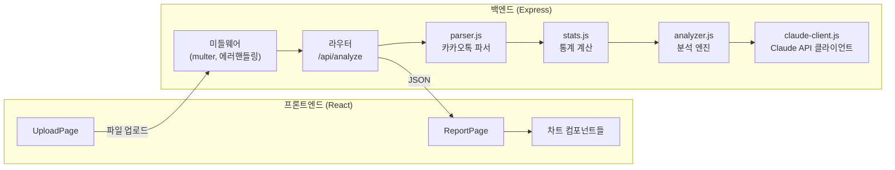

# 설계 문서: 카톡 관계 분석기

## 개요

카톡 관계 분석기는 카카오톡 대화 내보내기 txt 파일을 업로드하면 AI(Claude API)가 관계의 온도, 말투 성향, 대화 패턴 등 10개 항목을 자동 분석하여 리포트를 제공하는 웹 서비스이다.

단일 서버 아키텍처를 채택하여 Node.js Express 서버가 백엔드 API와 React 빌드 정적 파일 서빙을 모두 담당한다. DB 없이 파일 업로드 → 파싱 → AI 분석 → 결과 반환의 스테이트리스 파이프라인으로 동작하며, EC2 단일 인스턴스에 배포한다.

### 핵심 설계 결정

| 결정 사항 | 선택 | 근거 |
|-----------|------|------|
| 아키텍처 | 단일 서버 (Express) | 사용자 수 적음, 3-tier 불필요 |
| 프론트엔드 서빙 | Express 정적 파일 서빙 | 별도 웹서버 불필요, 단순화 |
| 데이터 저장 | 없음 (스테이트리스) | 파일 업로드→분석→반환이 전부 |
| AI 분석 | Claude API | 자연어 분석 품질 |
| 배포 | EC2 단일 인스턴스 | 단순 운영 |

## 아키텍처

### High-Level Architecture



### 요청 흐름




### Low-Level Architecture: 모듈 구조



## 컴포넌트 및 인터페이스

### 백엔드 컴포넌트

#### 1. Express 서버 (`server.js`)

애플리케이션 진입점. 미들웨어 설정, 라우팅, 정적 파일 서빙을 담당한다.

```
- 정적 파일 서빙: express.static('client/build')
- 파일 업로드: multer (메모리 스토리지, 10MB 제한)
- CORS: 개발 환경에서만 활성화
- 에러 핸들링: 글로벌 에러 핸들러
```

#### 2. 카카오톡 파서 (`parser.js`)

카카오톡 내보내기 txt 파일을 구조화된 대화_데이터로 변환한다.

```typescript
// 인터페이스
interface ParseResult {
  messages: Message[];
  participants: string[];
  chatRoomName: string;
  period: { start: Date; end: Date };
}

interface Message {
  sender: string;
  timestamp: Date;
  content: string;
  isSystemMessage: boolean;
}

// 주요 함수
parse(fileContent: string): ParseResult
// 내부 함수
parseLine(line: string): Message | null
parseTimestamp(dateStr: string, timeStr: string): Date
isSystemMessage(content: string): boolean
mergeMultilineMessages(lines: string[]): string[]
```

파싱 규칙:
- 날짜 헤더: `--------------- YYYY년 M월 D일 요일 ---------------`
- 메시지 라인: `[발화자] [오전/오후 H:MM] 메시지 내용`
- 여러 줄 메시지: 다음 메시지 패턴이 나올 때까지 이전 메시지에 결합
- 시스템 메시지: "님이 들어왔습니다", "님이 나갔습니다", "사진", "이모티콘" 등

#### 3. 통계 계산 모듈 (`stats.js`)

대화_데이터에서 수치 통계를 계산한다. Claude API 호출 없이 로컬에서 처리 가능한 지표들을 담당한다.

```typescript
interface Stats {
  totalMessages: number;
  periodDays: number;
  messagesPerParticipant: Record<string, number>;
  speakRatio: Record<string, number>;        // 발화 비율 (%)
  firstContactRatio: Record<string, number>; // 먼저 연락 비율 (%)
  sessions: Session[];
  gaps: GapPeriod[];
}

interface Session {
  startTime: Date;
  endTime: Date;
  messageCount: number;
  initiator: string;
}

interface GapPeriod {
  startDate: Date;
  endDate: Date;
  durationDays: number;
}

// 주요 함수
calculateStats(data: ParseResult): Stats
findSessions(messages: Message[], gapMinutes: number = 30): Session[]
findGapPeriods(messages: Message[], gapHours: number = 48): GapPeriod[]
calculateFirstContactRatio(sessions: Session[]): Record<string, number>
```

#### 4. 분석 엔진 (`analyzer.js`)

통계 데이터와 대화 내용을 Claude API에 전달하여 AI 분석 결과를 생성한다.

```typescript
interface AnalysisResult {
  summary: SummaryMetrics;
  firstContact: FirstContactAnalysis;
  topicDistribution: TopicAnalysis;
  toneMine: ToneAnalysis;
  toneOther: ToneAnalysis;
  aiInsights: InsightItem[];
  whoAmI: WhoAmIAnalysis;
  relationshipScore: RelationshipScore;
  funPoints: FunPoint[];
  gapAnalysis: GapAnalysis;
}

// 주요 함수
analyze(parseResult: ParseResult, stats: Stats): Promise<AnalysisResult>
buildPrompt(parseResult: ParseResult, stats: Stats): string
parseClaudeResponse(response: string): AnalysisResult
```

#### 5. Claude API 클라이언트 (`claude-client.js`)

Claude API와의 통신을 담당한다.

```typescript
// 주요 함수
callClaude(prompt: string): Promise<string>

// 설정
- API Key: 환경변수 ANTHROPIC_API_KEY
- Model: claude-sonnet-4-20250514
- Max tokens: 4096
- 타임아웃: 60초
- 재시도: 최대 2회 (지수 백오프)
```

#### 6. API 라우터 (`routes/analyze.js`)

```
POST /api/analyze
  - Content-Type: multipart/form-data
  - Body: file (txt 파일)
  - Response: AnalysisResult (JSON)
  - Error Responses:
    - 400: 파일 형식 오류, 파싱 오류
    - 413: 파일 크기 초과
    - 502: Claude API 호출 실패
    - 500: 서버 내부 오류
```

### 프론트엔드 컴포넌트

#### 페이지 구조

```
App
├── UploadPage          # 파일 업로드 화면
│   ├── FileDropZone    # 드래그앤드롭 + 파일 선택
│   └── ErrorMessage    # 유효성 오류 표시
├── LoadingPage         # 분석 진행 중 화면
│   └── ProgressBar     # 진행 상태 표시
└── ReportPage          # 분석 결과 리포트
    ├── SummaryCards     # 핵심 지표 카드 (요구사항 3)
    ├── FirstContactChart # 먼저 연락 비율 차트 (요구사항 4)
    ├── TopicChart       # 대화 주제 분포 차트 (요구사항 5)
    ├── ToneRadarChart   # 말투 분석 레이더 차트 (요구사항 6, 7)
    ├── AIInsights       # AI 인사이트 섹션 (요구사항 8)
    ├── WhoAmI           # Who Am I 섹션 (요구사항 9)
    ├── RelationshipGauge # 관계 종합 점수 게이지 (요구사항 10)
    ├── FunPoints        # 재밌는 포인트 섹션 (요구사항 11)
    └── GapTimeline      # 공백 기간 타임라인 (요구사항 12)
```

#### 차트 라이브러리

Recharts를 사용한다. React 생태계와의 호환성이 좋고, 레이더 차트, 도넛 차트, 바 차트, 게이지 등 필요한 차트 유형을 모두 지원한다.

#### 상태 관리

React의 useState/useReducer로 충분하다. 페이지가 3개(업로드/로딩/리포트)뿐이고 전역 상태가 거의 없다.

```typescript
type AppState = 
  | { phase: 'upload' }
  | { phase: 'loading'; progress: string }
  | { phase: 'report'; data: AnalysisResult }
  | { phase: 'error'; message: string };
```


## 데이터 모델

### 요청/응답 데이터 구조

#### 분석 요청

```
POST /api/analyze
Content-Type: multipart/form-data

file: <카카오톡 대화 txt 파일>
```

#### 분석 응답 (AnalysisResult)

```json
{
  "summary": {
    "totalMessages": 12450,
    "periodDays": 365,
    "relationshipType": "절친",
    "relationshipTemperature": 82
  },
  "firstContact": {
    "ratios": { "나": 62, "상대방": 38 },
    "totalSessions": 450
  },
  "topicDistribution": {
    "topics": [
      { "name": "일상", "percentage": 35 },
      { "name": "음식", "percentage": 20 },
      { "name": "감정", "percentage": 15 },
      { "name": "약속", "percentage": 12 },
      { "name": "학교", "percentage": 10 },
      { "name": "기타", "percentage": 8 }
    ]
  },
  "toneMine": {
    "warmth": 75,
    "consideration": 68,
    "humor": 82,
    "activeness": 70,
    "keywords": ["리액션 장인", "이모티콘 러버", "공감왕"]
  },
  "toneOther": {
    "warmth": 60,
    "consideration": 72,
    "humor": 55,
    "activeness": 45,
    "keywords": ["쿨한 답변러", "핵심만 말하는 타입", "가끔 따뜻"]
  },
  "aiInsights": [
    {
      "insight": "상대방은 감정적으로 힘든 날에 먼저 연락하는 경향이 있습니다.",
      "evidence": "공백 기간 이후 대화 재개 시 감정 관련 주제가 70% 이상"
    }
  ],
  "whoAmI": {
    "description": "상대방의 입장에서 보면, 당신은 항상 먼저 연락해주는 든든한 존재입니다...",
    "evidences": ["매주 월요일 아침 안부 인사", "상대방 고민 상담 시 평균 응답 시간 3분"]
  },
  "relationshipScore": {
    "score": 82,
    "label": "절친",
    "description": "서로에게 편안하고 깊은 신뢰가 있는 관계입니다."
  },
  "funPoints": [
    {
      "title": "ㅋㅋㅋ 마스터",
      "description": "두 분의 대화에서 'ㅋ'이 총 3,247번 등장했습니다.",
      "excerpt": "나: 야 그거 봤어? ㅋㅋㅋㅋㅋ\n상대방: ㅋㅋㅋㅋㅋㅋㅋ 미쳤어 진짜"
    }
  ],
  "gapAnalysis": {
    "gaps": [
      {
        "startDate": "2024-03-15",
        "endDate": "2024-03-20",
        "durationDays": 5,
        "beforePattern": "짧은 단답 위주",
        "afterPattern": "긴 대화, 감정 공유 증가"
      }
    ]
  }
}
```

### 내부 데이터 구조

#### ParseResult (파서 출력)

```typescript
interface ParseResult {
  messages: Message[];
  participants: string[];
  chatRoomName: string;
  period: {
    start: Date;
    end: Date;
  };
}

interface Message {
  sender: string;
  timestamp: Date;
  content: string;
  isSystemMessage: boolean;
}
```

#### Stats (통계 계산 출력)

```typescript
interface Stats {
  totalMessages: number;
  periodDays: number;
  messagesPerParticipant: Record<string, number>;
  speakRatio: Record<string, number>;
  firstContactRatio: Record<string, number>;
  sessions: Session[];
  gaps: GapPeriod[];
}

interface Session {
  startTime: Date;
  endTime: Date;
  messageCount: number;
  initiator: string;
}

interface GapPeriod {
  startDate: Date;
  endDate: Date;
  durationDays: number;
}
```

### Claude API 프롬프트 구조

분석 엔진은 통계 데이터와 대화 샘플을 포함한 구조화된 프롬프트를 Claude에 전달한다.

```
[시스템 프롬프트]
당신은 카카오톡 대화를 분석하는 관계 분석 전문가입니다.
주어진 대화 데이터와 통계를 바탕으로 아래 항목을 분석해주세요.
반드시 JSON 형식으로 응답해주세요.

[분석 항목]
1. 핵심 지표 요약 (관계 유형, 관계 온도)
2. 대화 주제 분포
3. 말투 분석 (나) - 따뜻함/배려심/유머감각/적극성 + 키워드 태그
4. 말투 분석 (상대방) - 따뜻함/배려심/유머감각/적극성 + 키워드 태그
5. AI 인사이트 (3개 이상)
6. Who Am I (200자 이상)
7. 관계 종합 점수 + 유형 라벨
8. 재밌는 포인트 (2개 이상)
9. 공백 기간 전후 패턴 변화

[통계 데이터]
{stats JSON}

[대화 데이터 (최근 500개 메시지 샘플)]
{messages}
```

대화 데이터가 너무 길 경우, 최근 500개 메시지 + 초반 100개 메시지를 샘플링하여 토큰 제한 내에서 처리한다.


## 정확성 속성 (Correctness Properties)

*속성(property)이란 시스템의 모든 유효한 실행에서 참이어야 하는 특성 또는 동작이다. 속성은 사람이 읽을 수 있는 명세와 기계가 검증할 수 있는 정확성 보장 사이의 다리 역할을 한다.*

이 프로젝트에서 PBT가 적합한 영역은 카카오톡 파서(`parser.js`)와 통계 계산 모듈(`stats.js`)이다. 이들은 순수 함수로서 입력에 따라 결과가 달라지며, 다양한 입력에 대해 보편적 속성을 검증할 수 있다. AI 분석(Claude API) 관련 항목은 외부 서비스 의존성이 있어 integration 테스트로 처리한다.

### Property 1: 파싱 라운드트립

*For any* 유효한 대화_데이터(ParseResult)에 대해, 대화_데이터를 카카오톡 내보내기 텍스트 형식으로 직렬화한 뒤 다시 파싱하면 원본과 동일한 대화_데이터가 생성되어야 한다. 이 속성은 날짜 패턴 인식(오전/오후, 다양한 날짜)과 멀티라인 메시지 결합의 정확성도 함께 검증한다.

**Validates: Requirements 2.6, 2.2, 2.3**

### Property 2: 메시지 파싱 구조적 완전성

*For any* 유효한 카카오톡 내보내기 텍스트에 대해, 파서가 생성한 대화_데이터의 모든 비-시스템 메시지는 비어있지 않은 sender, 유효한 timestamp(Date 객체), 비어있지 않은 content를 가져야 한다. 또한 participants 배열은 메시지에 등장하는 모든 고유 발화자를 포함해야 한다.

**Validates: Requirements 2.1**

### Property 3: 먼저 연락 비율 불변 속성

*For any* 세션(Session) 목록에 대해, calculateFirstContactRatio가 반환하는 각 발화자의 비율은 0~100 범위이며, 모든 발화자의 비율 합은 정확히 100이어야 한다. 또한 세션이 0개인 경우 모든 비율은 0이어야 한다.

**Validates: Requirements 4.1**

### Property 4: 공백 기간 탐지 정확성

*For any* 메시지 타임스탬프 목록에 대해, findGapPeriods가 반환하는 모든 공백 기간은 48시간 이상이어야 하며, 반환되지 않은 연속 메시지 쌍 사이의 간격은 48시간 미만이어야 한다. 또한 공백 기간은 시간순으로 정렬되어야 한다.

**Validates: Requirements 12.1**


## 에러 처리

### 에러 계층 구조

```
AppError (base)
├── FileValidationError (400)
│   ├── InvalidFileTypeError: "txt 파일만 업로드 가능합니다"
│   └── FileSizeLimitError: "파일 크기는 10MB 이하만 가능합니다"
├── ParseError (400)
│   ├── InvalidFormatError: "카카오톡 대화 내보내기 파일이 아닙니다"
│   └── EmptyFileError: "파일 내용이 비어있습니다"
├── AnalysisError (502)
│   ├── ClaudeAPIError: "분석 서비스에 일시적인 문제가 발생했습니다. 잠시 후 다시 시도해주세요"
│   └── ClaudeTimeoutError: "분석 시간이 초과되었습니다. 잠시 후 다시 시도해주세요"
└── InternalError (500)
    └── UnexpectedError: "서버 내부 오류가 발생했습니다"
```

### 에러 응답 형식

```json
{
  "error": {
    "code": "INVALID_FILE_TYPE",
    "message": "txt 파일만 업로드 가능합니다"
  }
}
```

### 에러 처리 전략

| 에러 유형 | HTTP 상태 | 재시도 | 사용자 메시지 |
|-----------|-----------|--------|---------------|
| 파일 형식 오류 | 400 | 불필요 | 프론트엔드에서 사전 차단 |
| 파일 크기 초과 | 413 | 불필요 | 프론트엔드에서 사전 차단 |
| 파싱 오류 | 400 | 불필요 | 구체적 오류 원인 표시 |
| Claude API 실패 | 502 | 서버 2회 자동 재시도 | 재시도 안내 |
| Claude API 타임아웃 | 502 | 서버 1회 자동 재시도 | 재시도 안내 |
| 서버 내부 오류 | 500 | 불필요 | 일반 오류 메시지 |

### 프론트엔드 에러 처리

- 파일 선택 시: 확장자와 크기를 클라이언트에서 먼저 검증하여 불필요한 서버 요청 방지
- API 호출 실패 시: 에러 메시지를 사용자에게 표시하고 "다시 시도" 버튼 제공
- 네트워크 오류 시: "네트워크 연결을 확인해주세요" 메시지 표시

## 테스트 전략

### 이중 테스트 접근법

이 프로젝트는 단위 테스트와 속성 기반 테스트(PBT)를 병행한다.

### 속성 기반 테스트 (Property-Based Testing)

라이브러리: **fast-check** (JavaScript/TypeScript PBT 라이브러리)
테스트 프레임워크: **Jest**

각 속성 테스트는 최소 100회 반복 실행하며, 설계 문서의 속성을 참조하는 태그를 포함한다.

| 속성 | 대상 모듈 | 태그 |
|------|-----------|------|
| Property 1: 파싱 라운드트립 | parser.js | Feature: katalk-relationship-analyzer, Property 1: 파싱 라운드트립 |
| Property 2: 메시지 파싱 구조적 완전성 | parser.js | Feature: katalk-relationship-analyzer, Property 2: 메시지 파싱 구조적 완전성 |
| Property 3: 먼저 연락 비율 불변 속성 | stats.js | Feature: katalk-relationship-analyzer, Property 3: 먼저 연락 비율 불변 속성 |
| Property 4: 공백 기간 탐지 정확성 | stats.js | Feature: katalk-relationship-analyzer, Property 4: 공백 기간 탐지 정확성 |

### 단위 테스트 (Example-Based)

| 대상 | 테스트 내용 |
|------|-------------|
| parser.js | 시스템 메시지 구분 (2.4), 유효하지 않은 형식 오류 (2.5) |
| stats.js | 세션 분리 경계값, 빈 메시지 목록 처리 |
| analyzer.js | Claude API 응답 파싱, JSON 구조 검증 |
| API 라우터 | 400/502 에러 응답 (14.3, 14.4), 파일 업로드 처리 |
| React 컴포넌트 | 각 차트/섹션 컴포넌트 렌더링 (3.2, 4.2, 5.2, 6.3, 7.3, 10.3, 12.3, 13.1, 13.2) |

### 통합 테스트

| 대상 | 테스트 내용 |
|------|-------------|
| 전체 파이프라인 | 유효한 txt 파일 → JSON 응답 (Claude API 모킹) |
| Claude API 연동 | 실제 API 호출 (CI에서는 스킵, 수동 실행) |
| 분석 결과 구조 | AI 응답에 필수 필드 포함 여부 (3.1, 5.1, 6.1~6.2, 7.1~7.2, 8.1~8.2, 9.1~9.2, 10.1~10.2, 11.1~11.2, 12.2) |

### 스모크 테스트

| 대상 | 테스트 내용 |
|------|-------------|
| 서버 시작 | POST /api/analyze 엔드포인트 응답 확인 (14.1) |
| 환경 변수 | ANTHROPIC_API_KEY 미설정 시 오류 (15.2) |
| 빌드 | React 빌드 + Express 패키징 (15.1) |

### 프로젝트 디렉토리 구조

```
katalk-relationship-analyzer/
├── client/                    # React 프론트엔드
│   ├── public/
│   ├── src/
│   │   ├── components/
│   │   │   ├── UploadPage.jsx
│   │   │   ├── LoadingPage.jsx
│   │   │   ├── ReportPage.jsx
│   │   │   ├── SummaryCards.jsx
│   │   │   ├── FirstContactChart.jsx
│   │   │   ├── TopicChart.jsx
│   │   │   ├── ToneRadarChart.jsx
│   │   │   ├── AIInsights.jsx
│   │   │   ├── WhoAmI.jsx
│   │   │   ├── RelationshipGauge.jsx
│   │   │   ├── FunPoints.jsx
│   │   │   └── GapTimeline.jsx
│   │   ├── App.jsx
│   │   └── index.jsx
│   └── package.json
├── server/                    # Express 백엔드
│   ├── server.js              # 진입점
│   ├── routes/
│   │   └── analyze.js         # API 라우터
│   ├── lib/
│   │   ├── parser.js          # 카카오톡 파서
│   │   ├── stats.js           # 통계 계산
│   │   ├── analyzer.js        # 분석 엔진
│   │   └── claude-client.js   # Claude API 클라이언트
│   ├── errors/
│   │   └── index.js           # 에러 클래스 정의
│   └── package.json
├── tests/
│   ├── unit/
│   │   ├── parser.test.js
│   │   ├── stats.test.js
│   │   └── analyzer.test.js
│   ├── property/
│   │   ├── parser.property.test.js
│   │   └── stats.property.test.js
│   └── integration/
│       └── api.test.js
├── ecosystem.config.js        # PM2 설정 (EC2 배포용)
└── package.json               # 루트 (빌드 스크립트)
```
