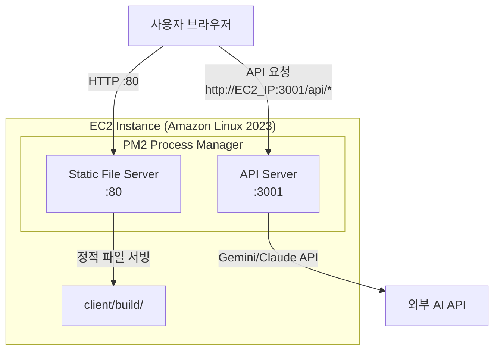
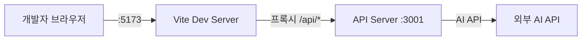

# Design Document: 2-Tier 클라이언트-서버 아키텍처

## Overview

카톡 관계 분석기를 모놀리식 구조에서 2-Tier 아키텍처로 분리한다. 현재 `server/server.js`가 React 빌드 파일 서빙과 API 처리를 모두 담당하는 구조를 다음과 같이 변경한다:

- **Tier 1 (Static File Server)**: `client/build/` 정적 파일 서빙 + SPA 폴백 (포트 80)
- **Tier 2 (API Server)**: Express REST API 전용 (포트 3001)

변경 범위는 서버 코드 리팩토링, CORS 설정, 클라이언트 API URL 설정, Static File Server 신규 생성, PM2/배포 스크립트 업데이트로 구성된다.

### 설계 결정 사항

1. **Static File Server 구현 방식**: `serve` 같은 외부 패키지 대신 간단한 Express 서버로 직접 구현한다. 이미 Express가 프로젝트에 있고, SPA 폴백 로직을 명시적으로 제어할 수 있다.
2. **포트 배정**: Static File Server가 포트 80(사용자 접점), API Server가 포트 3001(내부 통신). EC2에서 포트 80 바인딩을 위해 PM2를 root 권한으로 실행하거나 `authbind`를 사용한다(현재 배포 스크립트가 `sudo`로 실행되므로 기존 방식 유지).
3. **CORS 전략**: `cors` npm 패키지 활용. `ALLOWED_ORIGINS` 환경변수로 허용 오리진을 쉼표 구분 문자열로 설정. 미설정 시 개발 모드는 전체 허용, 프로덕션은 차단.
4. **클라이언트 API URL**: Vite의 `import.meta.env.VITE_API_URL`을 빌드 타임에 주입. 미설정 시 빈 문자열(상대 경로)로 폴백하여 개발 환경 프록시와 호환.

## Architecture



### 개발 환경 흐름



### 프로덕션 요청 흐름

1. 사용자가 `http://EC2_IP`(포트 7942)에 접속 → Static File Server가 `index.html` 반환
2. React 앱이 로드되어 `VITE_API_URL`(예: `http://EC2_IP:3001`)을 기반으로 API 호출
3. API Server가 CORS 헤더를 포함하여 응답

## Components and Interfaces

### 1. API Server (`server/server.js`) - 수정

**변경 사항:**
- `express.static` 미들웨어 제거
- SPA 폴백 라우트(`app.get('*')`) 제거
- CORS 설정을 환경변수 기반으로 변경
- Health check 엔드포인트 추가
- 비-API 라우트에 대한 404 JSON 응답 추가

```javascript
// CORS 설정 (변경)
const allowedOrigins = process.env.ALLOWED_ORIGINS
  ? process.env.ALLOWED_ORIGINS.split(',').map(o => o.trim())
  : null;

const corsOptions = {
  origin: (origin, callback) => {
    // 개발 환경 또는 ALLOWED_ORIGINS 미설정 시
    if (process.env.NODE_ENV !== 'production' && !allowedOrigins) {
      return callback(null, true);
    }
    // 프로덕션에서 ALLOWED_ORIGINS 설정됨
    if (allowedOrigins && allowedOrigins.includes(origin)) {
      return callback(null, true);
    }
    // origin이 없는 경우 (서버 간 요청, curl 등)
    if (!origin) {
      return callback(null, true);
    }
    callback(new Error('CORS not allowed'));
  },
};

app.use(cors(corsOptions));

// Health check
app.get('/api/health', (req, res) => {
  res.json({ status: 'ok' });
});

// API 라우터
app.use('/api', analyzeRouter);

// 비-API 라우트 404
app.use((req, res) => {
  res.status(404).json({ error: { code: 'NOT_FOUND', message: 'API endpoint not found' } });
});
```

**인터페이스:**
- `GET /api/health` → `{ status: "ok" }` (200)
- `POST /api/analyze` → 분석 결과 JSON (기존 유지)
- 기타 라우트 → `{ error: { code: "NOT_FOUND", ... } }` (404)

### 2. Static File Server (`server/static-server.js`) - 신규

`client/build/` 디렉토리의 정적 파일을 서빙하는 경량 Express 서버.

```javascript
const express = require('express');
const path = require('path');

const app = express();
const BUILD_DIR = path.join(__dirname, '../client/build');

// 정적 파일 서빙
app.use(express.static(BUILD_DIR));

// SPA 폴백
app.get('*', (req, res) => {
  res.sendFile(path.join(BUILD_DIR, 'index.html'));
});

const PORT = process.env.PORT || 80;
app.listen(PORT, () => {
  console.log(`Static file server running on port ${PORT}`);
});
```

**인터페이스:**
- 모든 정적 파일 요청 → 해당 파일 반환
- 파일이 아닌 경로 → `index.html` (SPA 폴백)

### 3. 클라이언트 API 설정 (`client/src/App.jsx`) - 수정

```javascript
// API Base URL 설정
const API_BASE_URL = import.meta.env.VITE_API_URL || '';

// 사용 예
const response = await axios.post(`${API_BASE_URL}/api/analyze`, formData, { ... });
```

### 4. Vite 설정 (`client/vite.config.js`) - 유지

기존 프록시 설정을 유지한다. 개발 환경에서 `VITE_API_URL`이 설정되지 않으면 빈 문자열이 되어 상대 경로(`/api/analyze`)로 요청하고, Vite 프록시가 이를 `http://localhost:3001`로 전달한다.

### 5. PM2 설정 (`ecosystem.config.js`) - 수정

```javascript
module.exports = {
  apps: [
    {
      name: 'katalk-static',
      cwd: '/home/ec2-user/environment/katalk-analyzer',
      script: 'server/static-server.js',
      autorestart: true,
      watch: false,
      env: {
        NODE_ENV: 'production',
        PORT: 80,
      },
    },
    {
      name: 'katalk-api',
      cwd: '/home/ec2-user/environment/katalk-analyzer',
      script: 'server/server.js',
      autorestart: true,
      watch: false,
      env: {
        NODE_ENV: 'production',
        PORT: 3001,
        ALLOWED_ORIGINS: 'http://3.93.199.150',
      },
    },
  ],
};
```

### 6. 배포 스크립트 (`deploy/02-setup-ec2.sh`) - 수정

주요 변경:
- PM2에서 기존 단일 프로세스 대신 두 프로세스 관리
- 클라이언트 빌드 시 `VITE_API_URL` 환경변수 주입
- 불필요한 파일 정리 단계 추가

### 7. 업로드 스크립트 (`deploy/01-upload.sh`) - 수정

rsync 제외 목록에 개발 전용 파일 추가:
- `tests/`, `jest.config.js`, `test-claude.js`, `*.png`, `.env.example`

## Data Models

이 변경은 데이터 모델에 영향을 주지 않는다. 기존 API 요청/응답 형식이 그대로 유지된다.

- **요청**: `POST /api/analyze` - `multipart/form-data` (txt 파일)
- **응답**: 기존 분석 결과 JSON 구조 유지
- **Health Check**: `GET /api/health` → `{ "status": "ok" }`
- **404 응답**: `{ "error": { "code": "NOT_FOUND", "message": "API endpoint not found" } }`

### 환경변수 (신규/변경)

| 변수명 | 위치 | 설명 | 기본값 |
|--------|------|------|--------|
| `ALLOWED_ORIGINS` | API Server | CORS 허용 오리진 (쉼표 구분) | 미설정 시 개발=전체허용, 프로덕션=차단 |
| `VITE_API_URL` | Client (빌드 타임) | API 서버 기본 URL | `""` (빈 문자열, 상대 경로) |
| `PORT` | Static File Server | 서빙 포트 | `80` |
| `PORT` | API Server | API 포트 | `3001` |


## Correctness Properties

*A property is a characteristic or behavior that should hold true across all valid executions of a system — essentially, a formal statement about what the system should do. Properties serve as the bridge between human-readable specifications and machine-verifiable correctness guarantees.*

이 기능은 주로 인프라 설정 및 서버 구성 변경이지만, CORS 로직, 라우트 처리, SPA 폴백 등 테스트 가능한 순수 로직이 존재한다.

### Property 1: 비-API 라우트 404 응답

*For any* 임의의 URL 경로 중 `/api/`로 시작하지 않는 경로에 대해, API Server는 HTTP 404 상태 코드와 `code`, `message` 필드를 포함하는 JSON 에러 응답을 반환해야 한다.

**Validates: Requirements 1.2**

### Property 2: CORS 허용 오리진 매칭

*For any* 쉼표로 구분된 오리진 문자열이 `ALLOWED_ORIGINS` 환경변수에 설정되어 있고, 해당 목록에 포함된 임의의 오리진에서 요청이 올 때, API Server의 응답에는 해당 오리진 값과 일치하는 `Access-Control-Allow-Origin` 헤더가 포함되어야 한다.

**Validates: Requirements 2.2, 2.3**

### Property 3: SPA 폴백

*For any* 파일 확장자가 없는 임의의 URL 경로에 대해, Static File Server는 `index.html`의 내용을 반환해야 한다.

**Validates: Requirements 4.3**

## Error Handling

### API Server 에러 처리

| 상황 | HTTP 상태 | 응답 형식 |
|------|-----------|-----------|
| 비-API 라우트 요청 | 404 | `{ "error": { "code": "NOT_FOUND", "message": "API endpoint not found" } }` |
| CORS 미허용 오리진 | 403 | CORS 에러 (브라우저가 차단) |
| 파일 업로드 크기 초과 | 413 | `{ "error": { "code": "FILE_SIZE_LIMIT", ... } }` (기존 유지) |
| 잘못된 파일 형식 | 400 | `{ "error": { "code": "INVALID_FILE_TYPE", ... } }` (기존 유지) |
| 서버 내부 오류 | 500 | `{ "error": { "code": "UNEXPECTED_ERROR", ... } }` (기존 유지) |

### Static File Server 에러 처리

- 정적 파일이 없는 경로 → SPA 폴백으로 `index.html` 반환 (React Router가 처리)
- `client/build/` 디렉토리가 없는 경우 → Express가 기본 404 반환 (배포 스크립트에서 빌드 선행 보장)

### CORS 에러 처리

- `ALLOWED_ORIGINS` 미설정 + 프로덕션 모드: `origin`이 있는 모든 크로스 오리진 요청 차단
- `origin`이 없는 요청(서버 간 통신, curl 등): 항상 허용 (보안상 문제없음, 브라우저만 Origin 헤더 전송)

## Testing Strategy

### 단위 테스트 (Example-based)

- **Health check 엔드포인트**: `GET /api/health` → 200, `{ status: "ok" }`, 응답 시간 < 500ms
- **CORS 기본 동작**: 개발 모드에서 모든 오리진 허용, 프로덕션 모드에서 미설정 시 차단
- **CORS preflight**: OPTIONS 요청에 `Content-Type` 허용 헤더 포함 확인
- **Static File Server 기본 서빙**: 루트 경로 접속 시 `index.html` 반환
- **PM2 설정 구조**: 두 개 프로세스 정의, 서로 다른 이름과 포트

### 속성 기반 테스트 (Property-based)

라이브러리: `fast-check` (이미 `server/devDependencies`에 설치됨)

각 테스트는 최소 100회 반복 실행한다.

- **Property 1**: 임의의 비-API 경로 생성 → API Server에 요청 → 404 + JSON 에러 응답 검증
  - 태그: `Feature: two-tier-architecture, Property 1: 비-API 라우트 404 응답`
- **Property 2**: 임의의 오리진 목록 생성 → `ALLOWED_ORIGINS` 설정 → 목록 내 오리진으로 요청 → `Access-Control-Allow-Origin` 헤더 매칭 검증
  - 태그: `Feature: two-tier-architecture, Property 2: CORS 허용 오리진 매칭`
- **Property 3**: 임의의 확장자 없는 경로 생성 → Static File Server에 요청 → `index.html` 내용 반환 검증
  - 태그: `Feature: two-tier-architecture, Property 3: SPA 폴백`

### 통합/스모크 테스트

- **배포 스크립트 검증**: rsync 제외 목록에 개발 전용 파일 포함 확인 (코드 리뷰)
- **PM2 프로세스 관리**: 두 프로세스 독립 실행 및 자동 재시작 확인 (수동 검증)
- **Vite 프록시**: 개발 환경에서 `/api/*` 프록시 동작 확인 (수동 검증)
- **EC2 파일 정리**: 배포 후 불필요 파일 부재 확인 (수동 검증)
